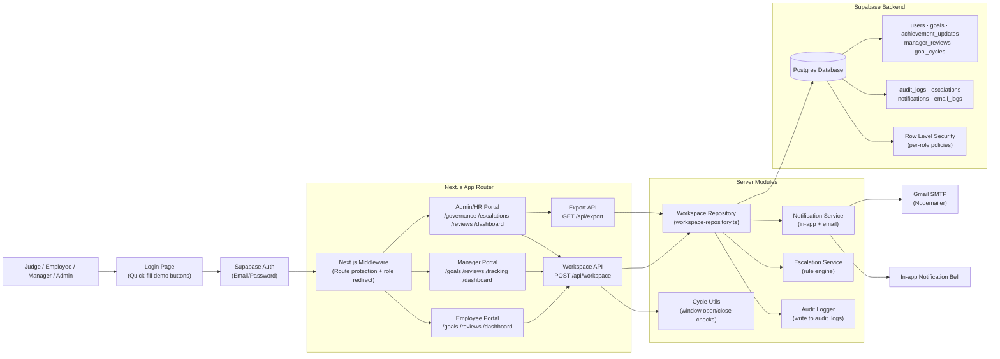
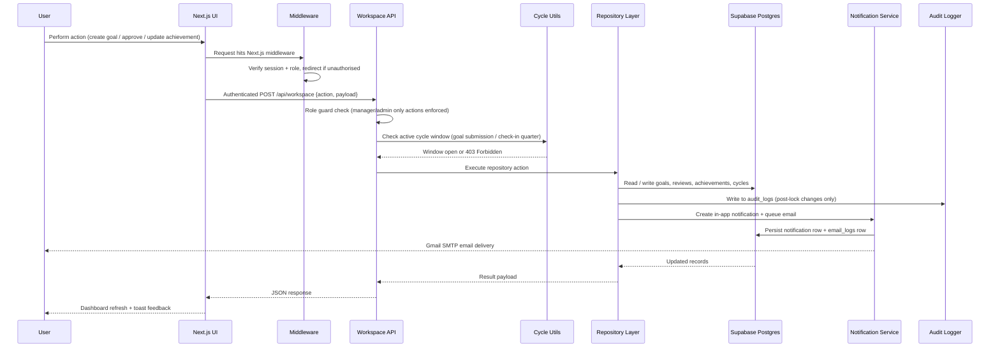
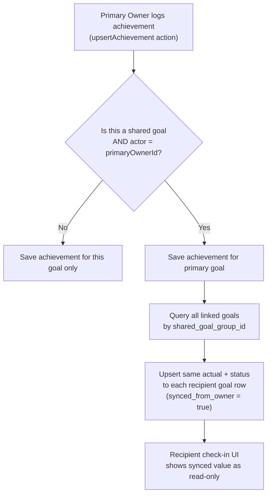
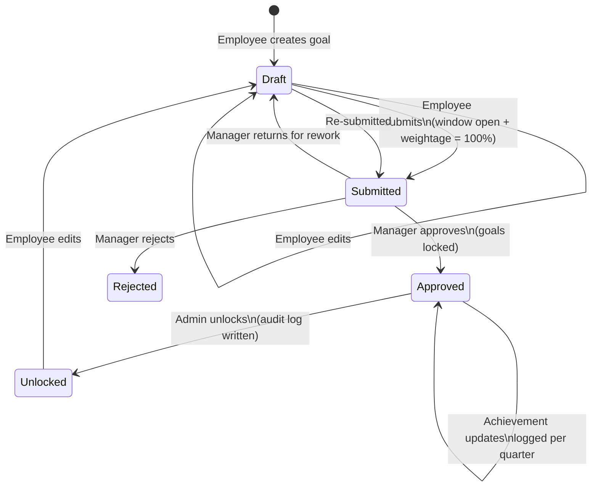
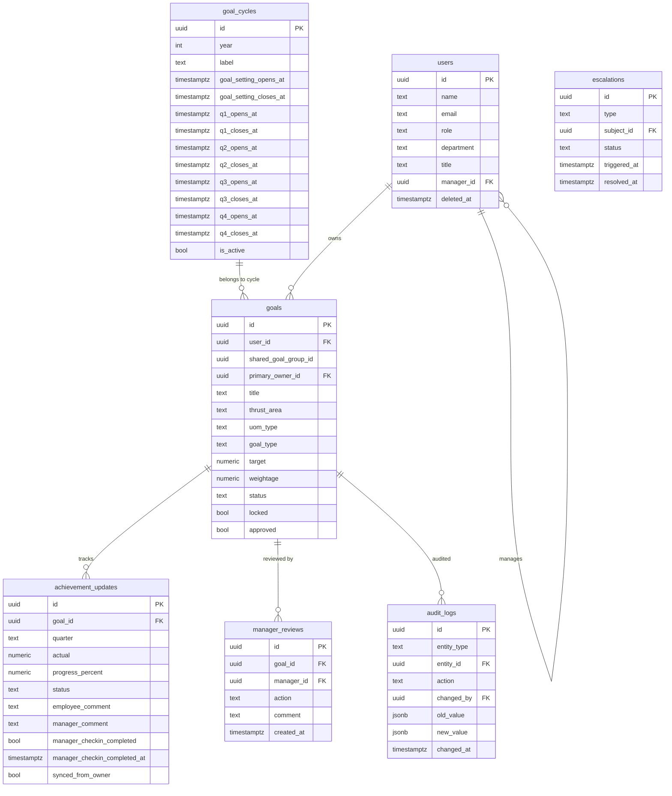

# AtomBerg GoalHub: Goal Setting & Tracking Portal


**Enterprise goal setting, approvals, quarterly progress tracking, and HR governance in one role-based portal.**

AtomBerg GoalHub is a hackathon implementation of an in-house **Goal Setting & Tracking Portal** for enterprise teams. It solves a common organizational problem: goals are scattered across spreadsheets, email threads, and appraisal documents, creating poor visibility, weak accountability, delayed approvals, and manual performance review workflows.

This project brings the workflow into a secure SaaS-style application where employees define measurable goals, managers review and approve them, and Admin/HR teams monitor organizational goal health through analytics, notifications, and escalation governance.

---

## Live Demo

**Hosted URL:** https://in-house-goal-setting-tracking-port-ten.vercel.app/

**Source Code:** https://github.com/SharadhamGupta/In-House-Goal-Setting-Tracking-Portal

---

## Hackathon Context

Built for **AtomQuest Hackathon 1.0** under the **In-House Goal Setting & Tracking Portal** challenge.

The solution covers all Phase 1 and Phase 2 BRD requirements:

- Structured employee goal creation with validation rules (max 8 goals, min 10% weightage, total must equal 100%)
- Manager (L1) approval and rejection workflow with inline editing
- Goal locking after approval with admin unlock capability
- Shared goals — admin/manager can push departmental KPIs to multiple employees
- Quarterly check-ins (Q1–Q4) with planned vs actual progress tracking
- System-computed progress scores for all four UoM types (Min, Max, Timeline, Zero)
- Role-based portals for Employee, Manager, and Admin/HR
- Dashboards, analytics, notifications, escalation governance, and audit trail

---

## Demo Accounts

The login page includes quick-fill demo buttons. Judges can also enter credentials manually.

| Role | Email | Password | Suggested Test Journey |
| --- | --- | --- | --- |
| Employee | `employee@demo.com` | `Employee123` | Create goals → submit for approval → update quarterly achievements → view progress |
| Manager | `manager@demo.com` | `Manager123` | Review submitted goals → approve/reject → conduct check-ins → send reminders |
| Admin/HR | `admin@demo.com` | `Admin123` | View org analytics → manage cycles → unlock goals → resolve escalations → audit trail |

---

## Feature Showcase

### Phase 1: Goal Setting & Approval

| Capability | Status | Implementation |
| --- | --- | --- |
| Goal Creation | ✅ Complete | Employees create up to 8 goals with Thrust Area, UoM type (Min/Max Numeric, %, Timeline, Zero), target, and weightage |
| Validation Rules | ✅ Complete | Max 8 goals enforced; minimum 10% weightage per goal; total weightage must equal exactly 100% before submission |
| Manager L1 Approval Workflow | ✅ Complete | Managers approve or reject submitted goals with inline target/weightage editing and structured comments |
| Goal Locking | ✅ Complete | Approved goals are locked — no edits without Admin intervention |
| Admin Goal Unlock | ✅ Complete | Admin can unlock any approved goal; all unlock events written to audit log |
| Shared Goals | ✅ Complete | Admin/manager pushes a configurable departmental KPI to multiple employees; recipients adjust weightage only; title and target are read-only |
| Shared Goal Achievement Sync | ✅ Complete | Primary owner's achievement updates propagate automatically to all linked recipient goal sheets |
| Goal Submission Window | ✅ Complete | Submission enforced within the configured cycle window (opens 1st May per BRD); banner shown to employees outside the window |
| Audit Trail | ✅ Complete | All post-lock changes (approvals, rejections, unlocks, field edits) written to audit_logs table with actor, timestamp, old value, and new value |

### Phase 2: Achievement Tracking & Quarterly Check-ins

| Capability | Status | Implementation |
| --- | --- | --- |
| Quarterly Check-in Interface | ✅ Complete | Employees log actual achievement against planned targets for Q1–Q4 |
| Quarter Window Enforcement | ✅ Complete | Check-in inputs disabled outside the active quarter window; API rejects out-of-window submissions |
| Goal Status Tracking | ✅ Complete | Per-goal status: Not Started / On Track / Completed |
| Progress Score Computation | ✅ Complete | System-computed scores: Min (Achievement÷Target), Max (Target÷Achievement), Timeline (completion vs deadline), Zero (100% if 0 else 0%) |
| Manager Check-in Module | ✅ Complete | Managers view planned vs actual per team member, add structured comments, and formally mark check-ins as complete |
| Check-in Completion Flag | ✅ Complete | Formal manager_checkin_completed flag per employee per quarter drives accurate completion dashboard metrics |

### Check-in Schedule (BRD Aligned)

| Period | Window | Action |
| --- | --- | --- |
| Goal Setting | 1st May | Goal creation, submission, and approval |
| Q1 Check-in | July | Progress update — planned vs actual |
| Q2 Check-in | October | Progress update — planned vs actual |
| Q3 Check-in | January | Progress update — planned vs actual |
| Q4 / Annual | March / April | Final achievement capture |

### Reporting & Governance

| Capability | Status | Implementation |
| --- | --- | --- |
| Achievement Report Export | ✅ Complete | Exportable CSV and XLSX showing planned target vs actual achievement per employee per quarter with progress scores |
| Completion Dashboard | ✅ Complete | Real-time view of check-in completion rates per manager and per quarter, based on formal completion flags |
| Audit Trail | ✅ Complete | Persisted audit_logs table — who changed what and when — visible to Admin/HR |
| Goal Cycle Management | ✅ Complete | Admin configures cycle year, label, and all window open/close dates; active cycle enforced across all submission and check-in gates |

### Bonus Features

| Capability | Status | Implementation |
| --- | --- | --- |
| Analytics Module | ✅ Complete | QoQ achievement trends, goal distribution by thrust area and UoM, manager effectiveness dashboard, heatmaps |
| Escalation Module | ✅ Complete | Rule-based escalation for submission delays, approval delays, and check-in delays; escalation chain with auto-notifications; admin resolution log |
| Email Notifications | ✅ Complete | Automated emails for goal submission, approval, rejection, quarterly check-in reminders, check-in window open, and escalation alerts — Gmail SMTP via Nodemailer with deduplication |
| In-app Notifications | ✅ Complete | Notification bell with unread state, per-event action links, and real-time badge count |
| Forgot Password | ✅ Complete | Self-service password reset via Supabase Auth email link |
| Loading States | ✅ Complete | Skeleton loaders on all route transitions — no blank flash on navigation |

---

## Role-Based Workflows

### Employee

- Create up to 8 measurable goals per cycle with thrust area, UoM, target, and weightage
- Validate total weightage equals 100% before submission
- Submit goals to manager for approval within the open goal-setting window
- Log quarterly achievement updates during active quarter windows (Q1–Q4)
- View personal progress scores, goal health, and notifications
- Self-service password reset

### Manager (L1)

- Review submitted goals from direct reports; edit targets and weightages inline before approving
- Approve or reject goal sheets with comments; approved goals are locked
- Push shared departmental KPIs to multiple team members
- Conduct quarterly check-ins: view planned vs actual, add structured comments, mark check-in complete
- Send quarterly reminder notifications to team
- View team analytics, approval load, and employee performance trends

### Admin / HR

- Monitor organisation-wide goal health and completion rates
- Manage goal cycles — configure window open/close dates, set active cycle
- Unlock approved goals for controlled exceptions (all unlock events audited)
- View full audit trail of all post-lock changes
- Sync and resolve escalation items for delayed workflow actions
- Export achievement reports in CSV or XLSX format

---

## Architecture

AtomBerg GoalHub follows a modular Next.js + Supabase architecture. The frontend renders role-aware dashboards, the Next.js API layer centralises workspace actions, and Supabase stores all authentication, users, goals, reviews, achievements, notifications, escalations, audit logs, and cycle configuration.



### Request Flow



### Shared Goal Achievement Sync Flow



### Goal Lifecycle State Machine



### Core Data Model

The schema is defined in `supabase/schema.sql` and includes:



---

## Tech Stack

### Frontend

| Technology | Why It Was Chosen |
| --- | --- |
| Next.js 15 App Router | Full-stack routing, API routes, middleware, and Vercel-optimised deployment |
| TypeScript 5 | Type-safe domain modelling for goals, roles, statuses, reviews, and achievement updates |
| Tailwind CSS | Fast, consistent enterprise UI with responsive layouts |
| shadcn/ui Components | Radix-based primitives — buttons, cards, dialogs, inputs, selects, toasts, dropdowns |
| Lucide React | Professional iconography for workflow states and dashboard actions |
| Recharts | Responsive charts for KPI dashboards, QoQ trends, distributions, and heatmaps |

### Backend & Data

| Technology | Why It Was Chosen |
| --- | --- |
| Supabase Auth | Email/password authentication, session handling, password reset, and route protection |
| Supabase Postgres | Relational model for users, goals, cycles, reviews, achievements, notifications, escalations, and audit logs |
| Row Level Security | Per-role access policies enforced at the database layer as a second line of defence |
| Next.js API Routes | Centralised workspace actions with API-level role guards before RLS |
| xlsx (SheetJS) | XLSX export for the achievement report (CSV also available) |

### Notifications

| Technology | Why It Was Chosen |
| --- | --- |
| Nodemailer + Gmail SMTP | Hackathon-stable email delivery with deduplication via email_logs table |
| In-app Notifications | Real-time bell with unread badge; functional even without SMTP credentials configured |

### Deployment

| Technology | Why It Was Chosen |
| --- | --- |
| Vercel | Natural hosting target for Next.js with environment variable management and preview deployments |
| Supabase Cloud | Managed Auth and Postgres; scalable from hackathon to production |

---

## Project Structure

```txt
.
├── app/
│   ├── api/
│   │   ├── workspace/          # Main authenticated workspace API (all goal/review/cycle actions)
│   │   └── export/             # Achievement report export API (CSV + XLSX)
│   ├── dashboard/              # Role-aware dashboard with loading skeleton
│   ├── goals/                  # Employee goal creation + manager shared goal push
│   ├── reviews/                # Employee check-ins + manager check-in module + admin audit trail
│   ├── tracking/               # Progress tracking views
│   ├── governance/             # Admin: cycle management, goal register, unlock, manager effectiveness
│   ├── escalations/            # Admin escalation command centre
│   ├── reset-password/         # Password reset landing page (Supabase email link handler)
│   └── login/                  # Login page with quick-fill demo buttons
├── components/
│   ├── dashboard/              # KPI cards, analytics charts, QoQ trends, heatmaps
│   ├── escalations/            # Escalation rule display and resolution UI
│   ├── goals/                  # Goal form dialog, shared goal push panel
│   ├── governance/             # Cycle management panel, goal register, audit trail tab
│   ├── notifications/          # Notification bell, unread badge, action links
│   ├── reviews/                # Employee check-in form, manager team check-ins, completion dashboard
│   └── ui/                     # Reusable primitives + PageSkeleton loader
├── lib/
│   ├── domain/                 # Types, validation, progress computation, cycle utils, workspace context
│   ├── escalations/            # Escalation rule engine and resolution service
│   ├── notifications/          # Notification service, email templates, Nodemailer mailer
│   └── supabase/               # Supabase clients, middleware helpers
├── scripts/
│   └── seed-demo-accounts.mjs  # Seeded demo users and demo analytics data
└── supabase/
    ├── schema.sql              # Full DB schema: tables, indexes, RLS policies, triggers
    └── migrations/             # Incremental migration files (applied in order)
        ├── 001_add_department_title.sql
        ├── 002_add_goal_cycles.sql
        ├── 003_audit_logs_fix.sql
        ├── 004_achievement_synced_flag.sql
        ├── 005_manager_checkin_complete.sql
        └── 006_users_soft_delete.sql
```

---

## Hackathon Alignment

| Problem Statement Requirement | Status | Notes |
| --- | --- | --- |
| Employee goal creation | ✅ Complete | Draft goal CRUD with thrust area, UoM, target, weightage |
| Goal validation rules | ✅ Complete | Max 8 goals, min 10% per goal, total must equal 100% — enforced client + server |
| Manager L1 approval workflow | ✅ Complete | Submit → approve/reject with inline target/weightage editing and comments |
| Goal locking after approval | ✅ Complete | Locked flag set on approval; DB trigger prevents direct edits |
| Shared goals — push to multiple employees | ✅ Complete | Configurable title/target/UoM; recipients get weightage-only edit rights |
| Shared goals — achievement sync from primary owner | ✅ Complete | Primary owner update propagates to all linked recipient goal sheets |
| Goal submission window enforcement | ✅ Complete | API gate + UI banner; configured via admin cycle management |
| Quarterly check-in interface | ✅ Complete | Q1–Q4 actual achievement input with status selection |
| Quarter window enforcement | ✅ Complete | API rejects submissions outside active quarter window; UI shows window status |
| Progress score computation (all 4 UoM types) | ✅ Complete | Min, Max, Timeline, Zero formulas implemented server-side |
| Manager check-in module | ✅ Complete | Planned vs actual view, structured comments, formal mark-complete action |
| Achievement report export | ✅ Complete | CSV and XLSX with planned target vs actual per quarter per employee |
| Completion dashboard | ✅ Complete | Real-time check-in completion % per manager/quarter from formal completion flags |
| Audit trail | ✅ Complete | audit_logs table written on every post-lock change (approve, reject, unlock, field edit) |
| Goal cycle management | ✅ Complete | Admin UI to create/edit cycles and set window dates; active cycle enforced globally |
| Role-based portals | ✅ Complete | Employee, Manager, Admin/HR routes with middleware + API-level role guards |
| Admin unlock with governance | ✅ Complete | Admin unlocks goals; unlock event written to audit log with actor + timestamp |
| Analytics dashboards | ✅ Complete | QoQ trends, goal distribution, manager effectiveness, heatmaps |
| Email notifications | ✅ Complete | Goal submission, approval, rejection, check-in reminders, window-open alerts, escalation alerts |
| Escalation module | ✅ Complete | Rule-based escalation for submission delays, approval delays, check-in delays; auto-notification chain; admin resolution |
| Microsoft Entra ID / SSO | ✅ Complete | Supabase Azure AD provider configured; org hierarchy sync noted as production roadmap item |

---

## Notes for Judges

- The app is designed to be tested quickly through the three demo accounts with quick-fill buttons on the login page.
- The database seed creates users, goals, reviews, achievements, cycle configuration, and demo analytics data so dashboards are populated from the first login.
- Email notifications are functional through Gmail SMTP. The demo remains fully usable through in-app notifications even if SMTP credentials are not configured in the environment.
- All workspace data is read from Supabase through the Next.js API layer — no mock data, no localStorage.
- Goal submission and quarterly check-in inputs are gated by the active cycle's window dates, which the admin can configure in the Governance → Cycle Management panel.
- The audit trail is persisted in the `audit_logs` table and is visible to Admin/HR users under Reviews → Audit Trail.
